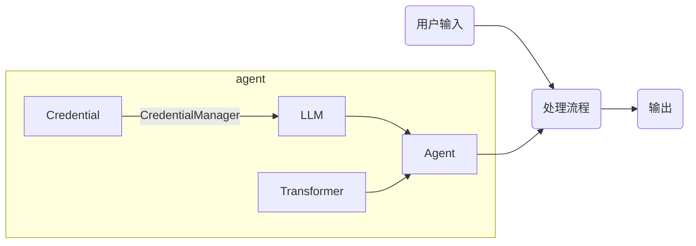
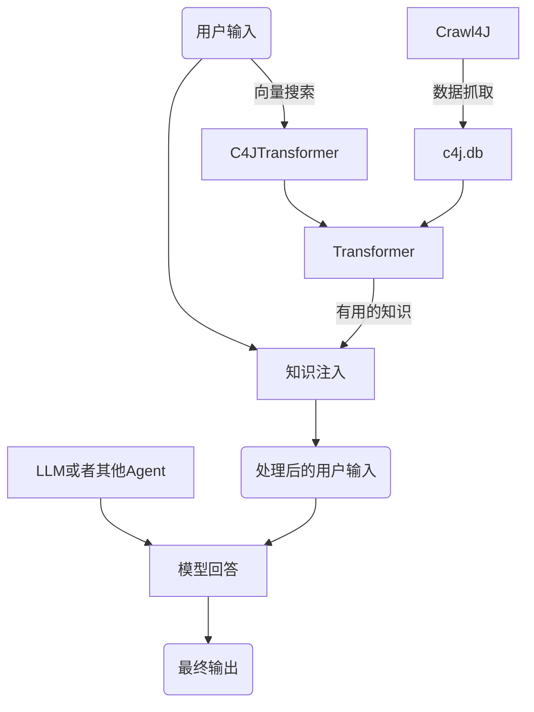
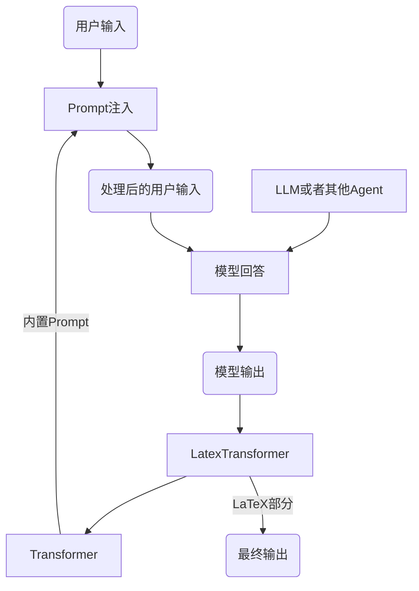

LC4J
--
LangChain for Java.  
WIP.

支持的模型列表：

| 模型名称       | √-支持 其他-不支持原因          |
|------------|------------------------|
| ChatGPT3.5 | √                      |
| ChatGPT4   | √                      |
| 星火大模型      | 不支持——内置Agent干扰Agent流程。 |
| 文心一言       | √                      |
| 通义千问       | √                      |
| 智谱清言       | 不支持——太容易莫名其妙截断。        |
| 盘古大模型      | WIP                    |

硬依赖：  
[BukkitHTTP](https://github.com/BukkitHTTP/BukkitHTTP) 函数库。  
软依赖：  
[Crawl4J](https://github.com/huzpsb/crawl4j) 构建知识库。

基本代码结构：

C4J知识注入：

LaTeX格式生成：

Sample:  
C4J效果展示

TEX效果展示

Author:  
@huzpsb  
All rights reserved.
